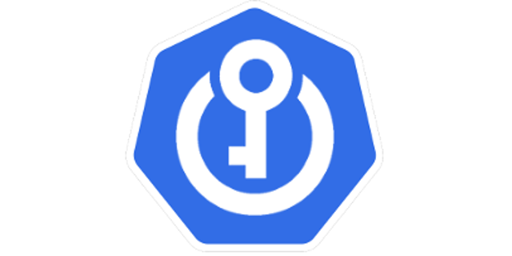

<p align="center"></p>
<h1 align="center">Azure Key Vault to Kubernetes</h1>
<p align="center">

  <a href="https://github.com/SparebankenVest/azure-key-vault-to-kubernetes/actions">
    
    
    
  </a>

  <a href="https://goreportcard.com/report/github.com/SparebankenVest/azure-key-vault-to-kubernetes">
    
  </a>
 
  <a href="https://github.com/SparebankenVest/azure-key-vault-to-kubernetes/releases/latest">
    
  </a>

  <a href="https://github.com/SparebankenVest/azure-key-vault-to-kubernetes/releases/latest">
    
  </a>

  <a href="https://hub.docker.com/r/spvest/azure-keyvault-controller">
    
  </a>

  <a href="https://hub.docker.com/r/spvest/azure-keyvault-webhook">
    
  </a>

<p>
  
<p align="center"><i>Azure Key Vault to Kubernetes (akv2k8s) makes Azure Key Vault secrets, certificates and keys available to your applications in Kubernetes, in a simple and secure way.</i></p> 

<p align="center"><i>Documentation available at <a href="https://akv2k8s.io">https://akv2k8s.io</a>. Join our <a href="https://join.slack.com/t/akv2k8s/shared_invite/zt-lfx2qdky-SGjwN8qTfca6bdeIyk46lg">Slack Workspace</a> to ask questions to the akv2k8s community.</i></p>

## Image Attestations

Container builds in this repository emit BuildKit provenance and SBOM attestations.

GitHub Actions workflows invoking `.github/actions/build` must grant `id-token: write`
permissions if you want GitHub OIDC-backed signatures for those attestations.

The current release flow copies images from the internal registry to the release registry.
That promotion step must also preserve OCI referrers, or released images may lose their
attached BuildKit attestations even when the source build produced them successfully.

Release workflows produce three verifiable outputs for the final published image:

1. A GitHub artifact attestation for the released image digest
2. A keyless cosign signature for the released image digest
3. Keyless cosign signatures for the published BuildKit attestation manifests

You can verify the GitHub artifact attestation for a released webhook image with:

```sh
gh attestation verify \
  "oci://docker.io/spvest/azure-keyvault-webhook:1.8.4-beta5" \
  --repo "SparebankenVest/azure-key-vault-to-kubernetes" \
  --signer-workflow "SparebankenVest/azure-key-vault-to-kubernetes/.github/workflows/webhook-release.yaml" \
  --source-ref "refs/tags/webhook-1.8.4-beta5"
```

Add `--format json` if you want to inspect the verified statement, subject digest, and
workflow identity in detail.

You can verify the corresponding keyless cosign signature with:

```sh
cosign verify \
  --certificate-identity-regexp 'https://github.com/SparebankenVest/azure-key-vault-to-kubernetes/.github/workflows/webhook-release.yaml@.*' \
  --certificate-oidc-issuer https://token.actions.githubusercontent.com \
  docker.io/spvest/azure-keyvault-webhook:1.8.4-beta5
```

Release workflows also sign the published BuildKit attestation manifests. You can list the
attestation digests from the published multi-arch index and verify one directly with:

```sh
docker buildx imagetools inspect --raw docker.io/spvest/azure-keyvault-webhook:1.8.4-beta5 \
  | jq -r '.manifests[] | select(.platform.architecture == "unknown" and .platform.os == "unknown") | .digest'

cosign verify \
  --certificate-identity-regexp 'https://github.com/SparebankenVest/azure-key-vault-to-kubernetes/.github/workflows/webhook-release.yaml@.*' \
  --certificate-oidc-issuer https://token.actions.githubusercontent.com \
  docker.io/spvest/azure-keyvault-webhook@sha256:<attestation-digest>
```

Release workflows also publish GitHub Releases for component tags. Those release pages
include generated release notes since the previous stable release for that component,
and attach plain SPDX SBOM assets for each published platform image.

You can also download the GitHub attestation bundle for offline verification with:

```sh
gh attestation download \
  "oci://docker.io/spvest/azure-keyvault-webhook:1.8.4-beta5" \
  --repo "SparebankenVest/azure-key-vault-to-kubernetes"
```

`cosign download attestation` may not discover these BuildKit attestation manifests reliably
even when they are published. Enumerating attestation manifests from the image index and then
inspecting the attestation manifest directly is the more reliable path.

You can inspect the attestation manifest and extract the SPDX SBOM layer with:

```sh
docker buildx imagetools inspect --raw docker.io/spvest/azure-keyvault-webhook@sha256:<attestation-digest>

oras blob fetch --output - \
  docker.io/spvest/azure-keyvault-webhook@sha256:<spdx-layer-digest> \
  | jq '.predicate' \
  > sbom.spdx.json
```

For example, for `1.8.4-beta5`, the `linux/amd64` attestation digest is:

```text
sha256:554cd2b648c9af939ee41065e8de2be231f0c6ccd7d5b94b9b931795c45a5290
```

and the SPDX layer digest inside that attestation manifest is:

```text
sha256:9e3cd7dafce50bdc39c19f33eaad76706cf059311388c0611c7607692f9bcff4
```

## Overview

Azure Key Vault to Kubernetes (akv2k8s) will make Azure Key Vault objects available to Kubernetes in two ways:

* As native Kubernetes `Secret`s 
* As environment variables directly injected into your Container application

The **Azure Key Vault Controller** (Controller for short) is responsible for synchronizing Secrets, Certificates and Keys from Azure Key Vault to native `Secret`s in Kubernetes.

The **Azure Key Vault Env Injector** (Env Injector for short) is responsible for transparently injecting Azure Key Vault secrets as environment variables into Container applications, without touching disk or exposing the actual secret to Kubernetes.

## Goals

The goals for this project were:

1. Avoid a direct program dependency on Azure Key Vault for getting secrets, and adhere to the 12 Factor App principle for configuration (https://12factor.net/config)
2. Make it simple, secure and low risk to transfer Azure Key Vault secrets into Kubernetes as native Kubernetes secrets
3. Securely and transparently be able to inject Azure Key Vault secrets as environment variables to applications, without having to use native Kubernetes secrets

All of these goals are met.

## Installation

For installation instructions, see documentation at https://akv2k8s.io/installation/.

## Credits

Credit goes to Banzai Cloud for coming up with the [original idea](https://banzaicloud.com/blog/inject-secrets-into-pods-vault/) of environment injection for their [bank-vaults](https://github.com/banzaicloud/bank-vaults) solution, which they use to inject Hashicorp Vault secrets into Pods.

## Contributing

Development of Azure Key Vault for Kubernetes happens in the open on GitHub, and we encourage users to:

* Send a pull request with 
  * any security issues found and fixed
  * your new features and bug fixes
  * updates and improvements to the documentation
* Report issues on security or other issues you have come across
* Help new users with issues they may encounter
* Support the development of this project and star this repo!

**[Code of Conduct](CODE_OF_CONDUCT.md)**

Sparebanken Vest has adopted a Code of Conduct that we expect project participants to adhere to. Please read the full text so that you can understand what actions will and will not be tolerated.

**[License](LICENSE)**

Azure Key Vault to Kubernetes is licensed under Apache License 2.0.

### Contribute to the Documentation

The documentation is located in a separate repository at https://github.com/SparebankenVest/akv2k8s-website. We're using Gatsby + MDX (Markdown + JSX) to generate static docs for https://akv2k8s.io.

## Creating a release ##

* Merge relevant PRs to master
* Wait for the builds to finish
* Run relevant tests

* When tested OK, run `make tag-all TAG=1.8.1`
* When push/tag is OK, update helm-chart
