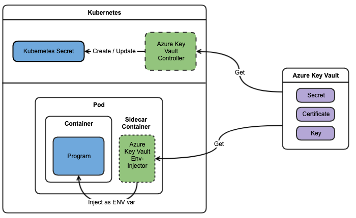

import DocsetMenu from '../components/docset-menu';
import { Button } from '@apollo/space-kit/Button';
import { Link } from 'gatsby';
import { colors } from 'gatsby-theme-apollo-core';
import {
  ExpansionPanel,
  ExpansionPanelList,
  ExpansionPanelListItem
} from 'gatsby-theme-apollo-docs';

Azure Key Vault to Kubernetes (akv2k8s) makes Azure Key Vault secrets, certificates and keys available in Kubernetes and/or your application - in a simple and secure way.

## The Goals of the Azure Key Vault to Kubernetes project

The Azure Key Vault to Kubernetes project was set out with these goals in mind:

<ExpansionPanelList>
<ExpansionPanelListItem number="1">

Avoid a direct program dependency on Azure Key Vault for getting secrets, and adhere to the 12 Factor App principle for configuration (https://12factor.net/config)

</ExpansionPanelListItem>
<ExpansionPanelListItem number="2">

Make it simple, secure and low risk to transfer Azure Key Vault secrets into Kubernetes as native Kubernetes secrets

</ExpansionPanelListItem>
<ExpansionPanelListItem number="3">

Bypass using Kubernetes Secrets entirely and transparently inject Azure Key Vault secrets directly into container applications

</ExpansionPanelListItem>
<ExpansionPanelListItem number="check">

All of these goals are met.

</ExpansionPanelListItem>
</ExpansionPanelList>

---

## Components

Akv2k8s contains two main components:

1. The **akv2k8s Controller** syncs Azure Key Vault objects to Kubernetes as native `Secret`'s
2. The **akv2k8s Injector** injects Azure Key Vault objects as environment variables directly into your application.

The diagram below illustrate the two options:

For more information about the inner workings of Azure Key Vault for Kubernetes, see [How it Works](how-it-works).

## Install both

The recommendation is to install both the Controller and the Env Injector, enabling native Kubernetes secrets when needed and transparently injecting environment variables for all other cases.

## When to use the Controller?

Use the Controller if:

* the native `Secret` support in Kubernetes is desired - e.g. you need to use a 3rd party Helm chart that expects a `Secret`
* the [risks documented with Secrets in Kubernetes](https://kubernetes.io/docs/concepts/configuration/secret/#risks) is acceptable
* there are no concerns about storing Azure Key Vault secrets as base64 encoded plain text values in Kubernetes `Secret` resources
* it is OK that anyone with read access to `Secret` resources in the Kubernetes cluster can read the content of the secrets

## When to use the Env Injector? 

Use the Env Injector if:

* the application running in the container support getting secrets as environment variables
* any of the [risks documented with Secrets in Kubernetes](https://kubernetes.io/docs/concepts/configuration/secret/#risks) is not acceptable
* there are concerns about storing and exposing base64 encoded Azure Key Vault secrets as Kubernetes `Secret` resources
* preventing Kubernetes users to gain access to Azure Key Vault secret content is important
* secret environment variable values should not be revealed to Kubernetes resources like Pod specs, stored on disks, visible in logs or exposed in any way other than in-memory for the application 

## Not convinced yet?

Go check out [Why use akv2k8s?](how-it-works) to see if that changes your mind.

## Want to get started?

  <Button
    size="large"
    color={colors.primary}
    as={<Link to="/quick-start" />}
  >
    Do the Quick Start!
  </Button>
 

