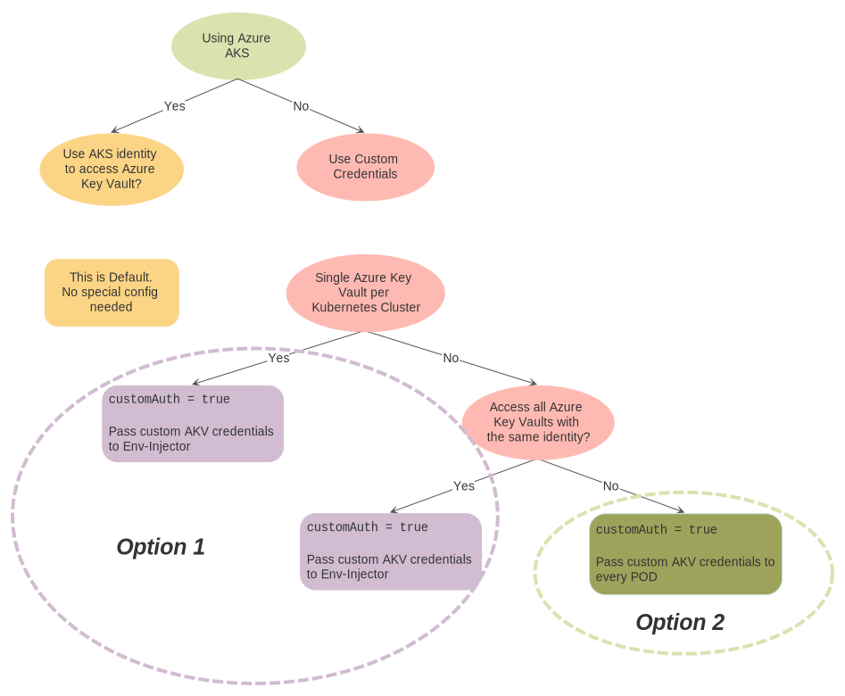

By default both the Controller and the Env Injector will assume it is running on Azure (since Azure Key Vault is most commonly used in Azure) - and use the default AKS credentials for authentication (a Service Principal or Azure Managed Identities) - unless custom authentication is provided.

The Controller and Env-Injector have to handle AKV authentication quite differently, as the Controller is centralized and the Env-Injector executes in context of Pods.

For more details about AKV authentication, see:
  * [AKV Authentication with the Controller](#akv-authentication-with-the-controller) for AKV Controller authentication options
  * [AKV Authentication with the Env-Injector](#akv-authentication-with-the-env-injector) for AKV Env-Injector authentication options

## Situations where Default Authentication does not Work

Currently only one situations has been identified, where default authentication does not work inside Azure.

**When a [Pod Security Policy](https://kubernetes.io/docs/concepts/policy/pod-security-policy/) is configured in the cluster, preventing containers from reading from the host.**

Two solutions exists:  
  1. Change the Pod Security Policy to list `/etc/kubernetes/azure.json` under [AllowedHostPaths](https://kubernetes.io/docs/concepts/policy/pod-security-policy/#volumes-and-file-systems) 
  2. Or use custom authentication (see below). 

## AKV Authentication with the Controller

The Controller will need AKV credentials to get Secrets from AKV and store them as Kubernetes Secrets. **If the default option (AKS credentials) works for you, use that.** If not, use custom authentication by passing inn the value `keyVault.customAuth.enabled=true` to the Controller and pick one of the [Authentication options](#custom-akv-authentication-options) described below.

Fore more details, see the [Controller Helm Chart](/vdefault/stable/azure-key-vault-controller/README/).

## AKV Authentication with the Env-Injector

The Env-Injector execute locally inside Pods and needs AKV credentials to download and inject secrets into container programs. You can either use default authentication (AKS credentials) or custom authentication. Use the following decision tree to find the best option:

> **For custom AKV authentication using Option 1 and akv2k8s versions `< 1.1.0`, set `customAuth.enabled=true` and `customAuth.autoInject.enabled=true` to have the Env-Injector auto-inject credentials as a Kubernetes Secret into Pods. Akv2k8s versions `> 1.1.0` handles this automatically through the auth-service introduced in version `1.1.0` without using Kubernetes Secret.**

> **For multi-tenant environments (using namespaces as isolation), Option 2 is currently the only viable option.**

Fore more details, see the [Env Injector Helm Chart](/vdefault/stable/azure-key-vault-env-injector/README/) and which custom AKV authentication options are available below.

## Custom AKV Authentication Options

The following authentication options are available:

| Authentication type |	Environment variable         | Description |
| ------------------- | ---------------------------- | ------------ |
| Managed identities for Azure resources (used to be MSI) | | No credentials are needed for managed identity authentication. The Kubernetes cluster must be running in Azure and the `aad-pod-identity` controller must be installed. A `AzureIdentity` and `AzureIdentityBinding` must be defined. See https://github.com/Azure/aad-pod-identity for details. |
| Client credentials 	| `AZURE_TENANT_ID` 	         | The ID for the Active Directory tenant that the service principal belongs to. |
|                     |	`AZURE_CLIENT_ID` 	         | The name or ID of the service principal. |
|                     |	`AZURE_CLIENT_SECRET`        | The secret associated with the service principal. |
| Certificate 	      | `AZURE_TENANT_ID`            | The ID for the Active Directory tenant that the certificate is registered with. |
|                     | `AZURE_CLIENT_ID`            | The application client ID associated with the certificate. |
|                     | `AZURE_CERTIFICATE_PATH`     | The path to the client certificate file. |
|                     | `AZURE_CERTIFICATE_PASSWORD` | The password for the client certificate. |
| Username/Password   | `AZURE_TENANT_ID`            | The ID for the Active Directory tenant that the user belongs to. |
|                     | `AZURE_CLIENT_ID`            | The application client ID. |
|                     | `AZURE_USERNAME`             | The username to sign in with.
|                     | `AZURE_PASSWORD`             | The password to sign in with. |

**Note: These env variables are sensitive and should be stored in a Kubernetes `Secret` resource, then referenced by [Using Secrets as Environment Variables](https://kubernetes.io/docs/concepts/configuration/secret/#using-secrets-as-environment-variables).** 

See official MS documentation for more details on how environment base authentication works for Azure: https://docs.microsoft.com/en-us/go/azure/azure-sdk-go-authorization#use-environment-based-authentication
